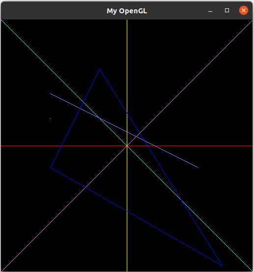

# Algoritmos de Rasterização

---

## Índice

- [Configuração, compilação e execução no Linux](#configuração-compilação-e-execução-no-linux)
- [Arquivos necessários à execução](#arquivos-necessários-à-execução)
- [Implementação](#implementação)
- [Resultado](#resultado)
- [Referências](#referências)

---

### Configuração, compilação e execução no Linux

1. Instale a OpenGL Utility Toolkit (GLUT) por meio do comando 

```bash
sudo apt-get install freeglut3-dev
```

2. Instale o pacote Miscellaneous Mesa GL utilities por meio do cmando 

```bash
sudo apt-get install mesa-utils
```

3. Instale as bibliotecas X11 miscellaneous utility library e X11 Input extension library por meio do comando 

```bash
sudo apt-get install libxmu-dev libxi-dev
```

4. Após completar as instalações, compile e execute o código main.cpp

```bash
g++ -o programa main.cpp -lglut -lGLU -lGL -lm && ./programa
```

## Arquivos necessários à execução

- [config.cpp](config.cpp)
- [definitions.cpp](definitions.cpp)
- [main.cpp](main.cpp)
- [main.h](main.h)
- [mygl.cpp](mygl.cpp)
- [mygl.h](mygl.h)

## Implementação

As funções PutPixel, DrawLine e DrawTriangle são definidas no arquivo mygl.h.

- Função putPixel

```c++
void PutPixel(int x, int y, int r, int g, int b) {
    if (x < 0 || x > IMAGE_WIDTH || y < 0 || y > IMAGE_HEIGHT) {
        return;
    }

    int index = (x + y * IMAGE_WIDTH) * 4;
    FBptr[index] = r;
    FBptr[index + 1] = g;
    FBptr[index + 2] = b;
    FBptr[index + 3] = 255;
}
```


- Função drawLine que implementa o algoritmo de Bresenham para traçado de linhas

```c++
void DrawLine(int x1, int y1, int x2, int y2, int r, int g, int b){
    
    int dx = abs(x2 - x1);
    int dy = abs(y2 - y1);
    bool slope = dy > dx;

    if (slope) {
        std::swap(x1, y1);
        std::swap(x2, y2);
    }

    if (x1 > x2) {
        std::swap(x1, x2);
        std::swap(y1, y2);
    }

    dx = std::abs(x2 - x1);
    dy = std::abs(y2 - y1);
    int erro = dx / 2;
    int y = y1;
    int ypasso = (y1 < y2) ? 1 : -1;

    for (int x = x1; x <= x2; ++x) {
        if (slope) {
            PutPixel(y, x, r, g, b);
        } else {
            PutPixel(x, y, r, g, b);
        }
        erro -= dy;
        if (erro < 0) {
            y += ypasso;
            erro += dx;
        }
    }
}

```


- Função DrawTriangle
   
```c++
void DrawTriangle(int x1, int y1, int x2, int y2, int x3, int y3, int r, int g, int b) {

    DrawLine(x1, y1, x2, y2, r, g, b);
    DrawLine(x2, y2, x3, y3, r, g, b);
    DrawLine(x3, y3, x1, y1, r, g, b);
}
```

- A Função MyGlDraw pertencente ao arquivo mygl.cpp é responsável pelo desenho das figuras.

```c++
void MyGlDraw(void)
{
    //*************************************************************************
    // Chame aqui as funções do mygl.h
    //*************************************************************************
    int x_max = IMAGE_WIDTH;
    int y_max = IMAGE_HEIGHT;
    int x_meio = (int)(IMAGE_WIDTH / 2);
    int y_meio = (int)(IMAGE_WIDTH / 2);
    
    PutPixel(100, 200, 255, 255, 255);
    
	DrawLine(0, 0, x_max, y_max, 0, 255, 255);
	DrawLine(0, x_meio, y_max, x_meio, 255, 0, 0);	
	DrawLine(0, x_max, y_max, 0, 255, 125, 255);
	DrawLine(x_meio, 0, x_meio, y_max, 255, 255, 0);
	DrawLine(100, 150, 400, 300, 125, 125, 255);	
    
    DrawTriangle(200, 100, 100, 300, 450, 500, 0, 0, 255);

}
```


## Resultado

<p align="center">
    <br>
    
    <h5 align="center">Figura 1 - Resultado das funções PutPixel, DrawLine e DrawTriangle executadas em MyGlDraw.</h5>
    <br>
</p>


## Referências

[GitHub do professor Maeslon Pacheco](https://gitlab.com/maelso/icg/-/tree/main/my_gl_framework)

AMMERAAL, Leendert; ZHANG, Kang; ZHANG, Kang. Computer graphics for Java programmers. Chichester: Wiley, 1998.

GORDON, V. Scott; CLEVENGER, John L. Computer graphics programming in OpenGL with C++. Mercury Learning and Information, 2020.
